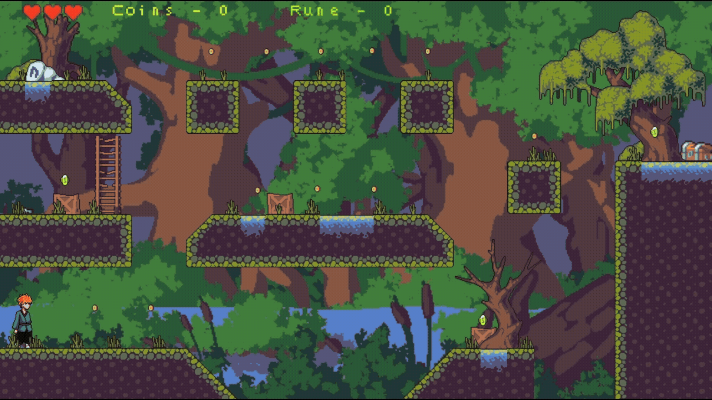
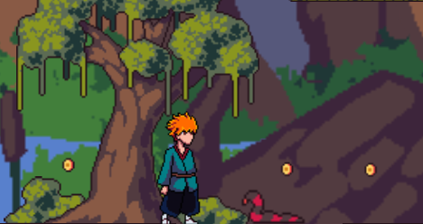
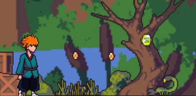
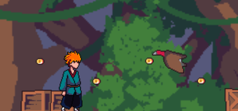
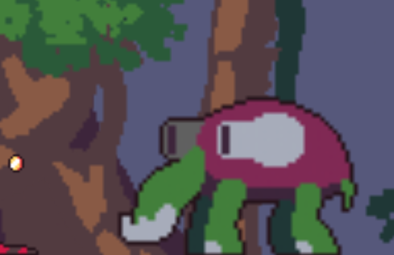

# 🪨 Stone Portal



**Stone Portal** é um jogo de plataforma 2D desenvolvido utilizando o **Construct 3**, focado em exploração, evasão e progressão por fases. O jogador embarca em uma jornada por um mundo misterioso repleto de ruínas antigas, criaturas fantásticas e segredos esquecidos, buscando encontrar o caminho de volta para casa.

### Status do Projeto: ✅ Concluído

<br>

## 📋 Sobre o Projeto

**Stone Portal** é um jogo de aventura em plataforma onde o jogador assume o papel de um explorador transportado para uma dimensão desconhecida após encontrar uma pedra misteriosa.

Sem armas ou habilidades de combate, a sobrevivência depende exclusivamente da movimentação, da exploração cuidadosa dos cenários e da capacidade de evitar inimigos enquanto coleta artefatos ancestrais necessários para avançar pelas fases.

### Objetivo

Desenvolver uma experiência de exploração e plataforma baseada em mecânicas de movimentação, coleta de itens e evasão de inimigos, incentivando a observação e o planejamento do jogador.

### Problema Resolvido

O projeto busca demonstrar a construção de um jogo completo utilizando o **Construct 3**, aplicando conceitos de level design, progressão por fases, inteligência básica de inimigos, coleta de itens e mecânicas de plataforma.

<br>

## ✨ Funcionalidades

### Funcionalidades Implementadas

* [x] Sistema de movimentação lateral
* [x] Sistema de pulo duplo
* [x] Sistema de interação com objetos
* [x] Coleta de moedas
* [x] Coleta de runas para progressão
* [x] Sistema de portais entre fases
* [x] Sistema de vida baseado em corações
* [x] Sistema de chaves e baús
* [x] Inimigos com comportamentos distintos
* [x] Efeitos especiais de inimigos
* [x] Boss final exclusivo
* [x] Sete fases jogáveis
* [x] Sistema de dano ao jogador

<br>

## 🛠️ Tecnologias Utilizadas

### Ferramentas


### Engine

* **Construct 3**

<br>

## 🏗️ Arquitetura do Projeto

O projeto segue uma arquitetura baseada em cenas e eventos, característica da engine Construct 3.

Principais características:

* Sistema orientado a eventos
* Separação por fases (layouts)
* Gerenciamento de estados do jogador
* Controle de progressão por objetivos
* Sistema de colisões e interações
* Componentização de entidades do jogo

<br>

## 📂 Estrutura de Diretórios

```text
stone-portal-game/
│
├── src/                      # Arquivos principais do jogo
│   ├── index.html            # Arquivo inicial da aplicação
│   ├── scripts/              # Scripts exportados pelo Construct 3
│   ├── images/               # Sprites e elementos visuais
│   └── media/                # Efeitos sonoros e músicas
│
├── docs/                     # Documentação do projeto
│   ├── screenshots/          # Capturas de tela
│   └── gifs/                 # Demonstrações da gameplay
│
└── README.md
```

<br>

## ⚙️ Pré-requisitos

Antes de iniciar, você precisará ter instalado:

* Navegador Web (Google Chrome, Brave ou Microsoft Edge)
* [Visual Studio Code (recomendado)](https://code.visualstudio.com/)
* Extensão Live Server (recomendado)

<br>

## 🚀 Como Executar

### 1. Clonar o Repositório

```bash
git clone https://github.com/DevJoaoVitorB/stone-portal-game.git
```

### 2. Entrar na Pasta

```bash
cd stone-portal-game
```

### 3. Abrir o Projeto

Abra a pasta do projeto no Visual Studio Code.

### 4. Instalar o Live Server

Na aba de extensões do VS Code:

```text
Live Server
```

Instale a extensão.

### 5. Executar o Jogo

Abra o arquivo:

```text
index.html
```

Clique com o botão direito e selecione:

```text
Open with Live Server
```

O navegador será aberto automaticamente com o jogo em execução.

<br>

## 📖 Lore

Durante uma expedição, um aventureiro encontra uma pedra ancestral capaz de transportá-lo para um mundo desconhecido. \
Nesse novo ambiente existem ruínas de uma civilização desaparecida e criaturas fantásticas que parecem proteger os segredos do local. \
Para retornar para casa, o explorador precisa encontrar runas ancestrais espalhadas pelo mundo e ativar antigos portais que o conduzirão através das diferentes regiões desse universo misterioso.

<br>


## 🎮 Mecânicas de Jogo

### Progressão

* Total de 7 fases
* 6 fases principais
* 1 fase final com boss

Para avançar, o jogador deve:

* Coletar 3 runas
* Ativar o portal da fase


### Sistema de Vida

* 3 corações
* Sem sistema de combate
* Foco total em evasão e exploração

### Coletáveis

* 🪙 Moedas — Pontuação
* 🔮 Runas — Progressão
* 🔑 Chaves — Acesso a baús

<br>

## 🎮 Controles

| Tecla | Ação                |
| ----- | ------------------- |
| ⬅️    | Mover para esquerda |
| ➡️    | Mover para direita  |
| ⬆️    | Pular               |
| ⬆️⬆️  | Pulo Duplo          |
| E     | Interagir           |

<br>

## 👾 Inimigos

### 🐍 Snake



* Movimento terrestre
* Dano: 1 ponto

### 🦂 Scorpion



* Movimento terrestre
* Dano: 1 ponto
* Paralisa o jogador por 2 segundos

### 🦅 Vulture



* Inimigo aéreo
* Dano: 1 ponto
* Pode carregar o jogador durante o voo

### 🐢 Mother Turtle (Boss Final)



* Sem movimentação
* Dispara mísseis teleguiados
* Causa 3 pontos de dano
* Eliminação instantânea em caso de acerto

<br>

## 👨‍💻 Autor

| **DevJoaoVitorB** |
| ----------------- |
|  |
| [](https://github.com/DevJoaoVitorB) [](https://www.linkedin.com/in/devjoaovitorb) |
